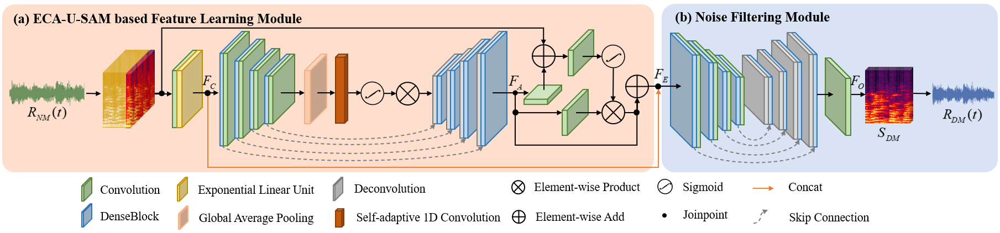
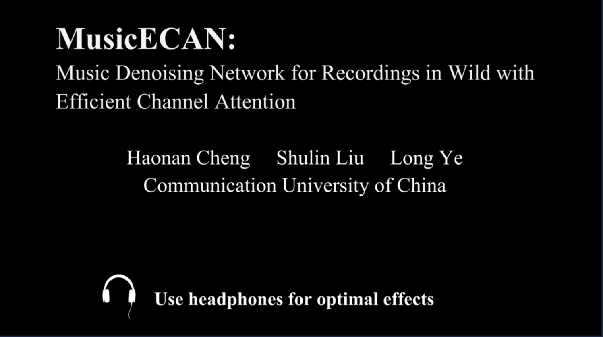
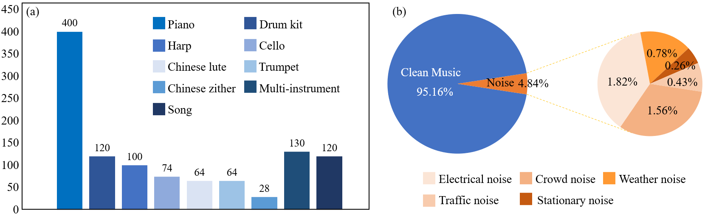

# MusicECAN: Music Denoising Network for Recordings in Wild with Efficient Channel Attention

## Abstract
In this work, we address the long-standing problem of automatic music denoising. Previous audio denoising works mainly focus on speech instead of music, and none of them considers the music recordings in the wild. To this end, we first propose MusicECAN, an automatic music denoising network that enables sound quality enhancement for recordings in the wild. The novel architecture includes two parts, namely feature learning module and noise filtering module, which can model, refine and denoise the noisy input efficiently yet effectively.  pecifically, in order to capture sufficient noisy music information, an ECA-U-SAM based feature learning module is designed by introducing an Efficient Channel Attention (ECA) mechanism in raditional U-net with a Supervised Attention Module (SAM). To train our proposed MusicECAN, we collect M&N, a dataset containing various videos and recordings of clean music and noise. By combining different clean and noise recording pairs, we can effectively simulate possible environments of music performance with different background noise. Various quantitative and qualitative comparisons demonstrate that our MusicECAN outperforms the state-of-the-art audio denoising methods.

## Demo Video
Watch the [demo video](https://www.kaggle.com/datasets/shulinliu/musicecan-demo). 

## Denoising Recordings

[Listening more denoising examples](https://slliugit.github.io/).

## M&N: A music dataset for denoising music recordings in wild
We introduce a dataset M&N, which can effectively meet the requirements of music denoising for recordings in the wild. The dataset comprises various videos and recordings of clean music and noise assembled from free sound effects website and existing cross-modal audio generation dataset FAIR-PLAY. For video data, we separate the visual and audio tracks of the video. We anticipate that the dataset will be useful for denoising task and also serve as ground-truth for evaluating performances.

For music data, we collect totally 1100 clean music recordings in wav format with a sampling rate of 44.1 kHz and bit depth of 16 bits, mono channel. The duration of each recording is between 9.984 seconds and 10.005 seconds. There are 9 categories of music recordings: piano, drum kit, harp, cello, Chinese lute, trumpet, Chinese zither, multi-instrument and song.

For noise data, we collect totally 63 noise recordings in wav format with a sampling rate of 44.1 kHz, and the duration of each recording is in the range of 4-30 seconds. According to audio content, the noise data is divided into five categories: 

* Electrical noise: Recordings of electrical circuit noise such as clicking, hissing noise and crackling noise caused by the irregularities in the storage medium, such as buzzer sound caused by signal interference between equipment, etc., which are used to simulate the equipment failure scenario that ordinary users may encounter when recording.

* Crowd noise: Recordings include the sound of crowd chatter, cheering and children’s laughter, etc., which are used to simulate the background noise when users record a piece of music at all people everywhere a large flow such as cocktail party, mall, theater or square.</li>

* Weather noise: Recordings include the sound of rain, wind, thunder and birdsong, which are used to simulate the weather noise when users record music in different natural environments.

* Traffic noise: Recordings include vehicle start-up sounds, road traffic sounds and motorcycle sounds, which are used to simulate the traffic noise when the user is recording audio near the driveway.

* Stationary noise: Recordings of random noise include white noise, pink noise and high frequency channel noise, for which the probability that the noise voltage lies within any given interval does not change with time.</li>

<a href="data/clean_music_metadata.csv">Download clean music recordings metadata</a>

<a href="data/noise_metadata.csv">Download noise recording recordings metadata</a>

    
## Code
Coming soon!
